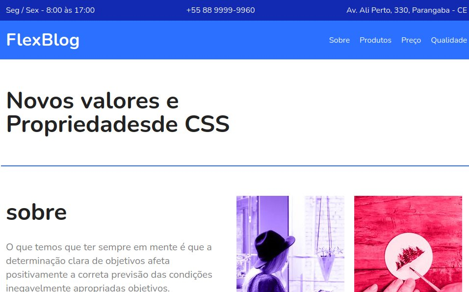

# CURSO CSS Flexbox

## Projeto web feito no curso CSS Flexbox da origamid

#### Site da ORIGAMIDE

- [SITE-ORIGAMID](https://www.origamid.com/curso/)

<h4 align="center"> 
	:sunglasses:  Curso finalisado  :ok:
</h4>

## Page

